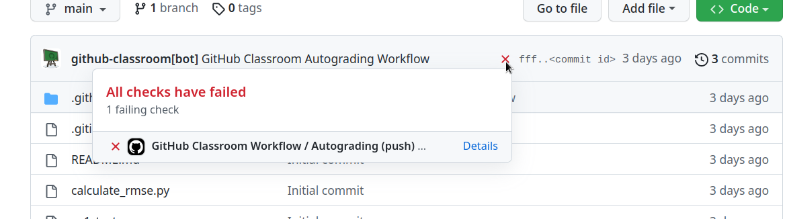

# Binary Classifier for MNIST

This repository contains solutions to exercises on implementing a binary classifier for MNIST dataset using PyTorch.

## Files

1. **`layered_model.py`**: Contains functions to define dense models, train the models for single digit classification, and evaluate their performance.

## Exercise Details

### Overview

In this exercise, you will implement a binary classifier to classify a single number from the MNIST dataset. The objectives include defining dense models with single and hidden layers, training the models, and evaluating their performance.

### Functions to Implement

1. **`define_dense_model_single_layer`**: Define a dense model with a single layer.
2. **`define_dense_model_with_hidden_layer`**: Define a dense model with a hidden layer.
3. **`fit_mnist_model_single_digit`**: Train the model for a single digit classification.
4. **`evaluate_mnist_model_single_digit`**: Evaluate the performance of the trained model.

### Validation and Evaluation

#### Online Platform

After committing and pushing your code:
1. Check the mark on the top line near the commit ID.
2. Review detailed test results by clicking on the ❌ to view errors.
3. Click on the [Details]() link to see specifics about failed tests and score details.



#### Local Testing

1. Install pytest if not already installed:
   ```sh
   pip install pytest
   ```
2. Run tests:
   ```sh
   pytest
   ```

## Usage

1. Clone the repository:
   ```sh
   git clone https://github.com/samiamjidkhan/binary-classifier-mnist.git
   cd binary-classifier-mnist
   ```

2. Implement and test your solutions following the instructions in `layered_model.py`.

### Running Tests

To validate locally:
1. Install pytest if not already installed:
   ```sh
   pip install pytest
   ```
2. Run tests:
   ```sh
   pytest
   ```

